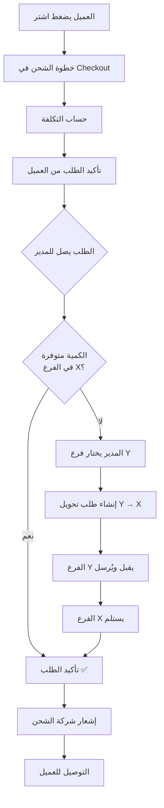

# الخطة التنفيذية — منظومة الشحن والتحويل في Payqusta

---

## أولاً: الأطراف الفاعلة (Stakeholders)

| الطرف | الدور | صلاحياته في المنظومة |
|---|---|---|
| **مدير النظام (Admin)** | صاحب المتجر | يضبط إعدادات الشحن، يؤكد الطلبات، يُنشئ طلبات التحويل |
| **مدير الفرع X** | مدير الفرع الرئيسي للشحن | يستقبل التحويلات الواردة، يؤكد الاستلام، يُشعر شركة الشحن |
| **مدير الفرع Y** | مدير الفرع المُرسِل | يقبل/يرفض طلبات التحويل، يجهّز ويُرسل البضاعة |
| **العميل** | المشتري من الموقع | يُدخل عنوانه، يرى تكلفة الشحن، يتابع حالة طلبه |
| **شركة الشحن** | المورد اللوجستي | تحسب التكلفة، تستلم البضاعة، توصّل للعميل |

---

## ثانياً: الكيانات الرئيسية في النظام (Data Entities)

```
الطلب (Order/Invoice)
  ├── العميل
  ├── المنتجات + الكميات
  ├── عنوان الشحن
  ├── الفرع الرئيسي (Branch X)
  ├── تكلفة الشحن
  └── حالة الطلب

طلب التحويل (Transfer Request)
  ├── الفرع المُرسِل (Y)
  ├── الفرع المُستقبِل (X)
  ├── المنتجات + الكميات
  ├── الطلب المرتبط به
  └── حالة التحويل

إعدادات الشحن (Shipping Config)
  ├── الفرع الرئيسي المُختار
  ├── نوع التسعير (ثابت/ديناميكي)
  ├── الزونز وأسعارها
  └── بيانات API شركة الشحن
```

---

## ثالثاً: منطق التسعير (Pricing Logic)

### المسار الأول — المناطق الثابتة (Zone-Based)

```
المدير يُنشئ زون "القاهرة الكبرى" → يحدد تكلفة ثابتة 35 جنيه
العميل يختار محافظة "القاهرة" في الـ Checkout
النظام يبحث: أي زون يشمل "القاهرة"؟
النتيجة: "القاهرة الكبرى" — التكلفة 35 جنيه ← تُضاف فوراً
```

| الحالة | السلوك |
|---|---|
| العميل في زون محدد | يُعرض السعر الثابت فوراً |
| العميل خارج كل الزونز | يُعرض رسالة "الشحن غير متاح لمنطقتك" أو سعر افتراضي |

---

### المسار الثاني — السعر الديناميكي (API-Based)

```
العميل يُدخل عنوانه
النظام يُرسل Request لـ API شركة الشحن:
  - من: عنوان الفرع X (shippingOrigin)
  - إلى: عنوان العميل
API ترد بـ: التكلفة + وقت التسليم المتوقع
تُعرض على العميل قبل تأكيد الطلب
```

| حالة الـ API | السلوك |
|---|---|
| ✅ نجحت | يُعرض السعر الحقيقي + وقت التسليم |
| ⏱ تأخر الرد (Timeout) | Spinner → رسالة خطأ → زر "إعادة المحاولة" |
| ❌ فشل الاتصال | يُعرض السعر الاحتياطي (Fallback) مع تنبيه "سعر تقريبي" |
| 🚫 محجوب كلياً | رسالة "خدمة الشحن غير متاحة" وإيقاف إتمام الطلب |

---

## رابعاً: دورة حياة الطلب الكاملة (Order Lifecycle)



### جدول حالات الطلب

| الرقم | الحالة | المعنى | من يُغيّرها |
|---|---|---|---|
| 1 | `pending` | قيد الانتظار | تلقائي عند إنشاء الطلب |
| 2 | `awaiting_confirmation` | انتظار تأكيد المدير | تلقائي بعد دفع العميل |
| 3 | `awaiting_stock_transfer` | انتظار تحويل المخزون | المدير عند إنشاء طلب التحويل |
| 4 | `transfer_in_progress` | التحويل جارٍ | تلقائي عند قبول الفرع Y |
| 5 | `ready_for_shipping` | جاهز للشحن | مدير الفرع X بعد الاستلام |
| 6 | `assigned_to_courier` | تم إسناده لشركة الشحن | تلقائي بعد إنشاء الشحنة |
| 7 | `out_for_delivery` | في الطريق للعميل | API شركة الشحن |
| 8 | `delivered` | تم التسليم ✅ | API شركة الشحن |
| 9 | `cancelled` | ملغي | المدير / العميل |
| 10 | `failed` | فشل التسليم | API شركة الشحن |

---

## خامساً: دورة حياة طلب التحويل (Transfer Lifecycle)

### التدفق الكامل

```
المدير (في تأكيد الطلب)
  └─► ينشئ طلب تحويل [الفرع Y → الفرع X]
         │
         ▼
الفرع Y يرى إشعار "طلب تحويل جديد"
  ├─► يقبل → الحالة: Approved
  │     └─► يجهّز البضاعة → الحالة: Prepared
  │           └─► يُرسل → الحالة: In Transit
  └─► يرفض → الحالة: Rejected
              └─► المدير يختار فرع بديل أو يلغي الطلب

الفرع X يرى "كمية في الطريق"
  ├─► يستلم كامل → الحالة: Fully Received
  │     └─► المخزون يُضاف لـ X، يُخصم من Y
  ├─► يستلم جزئي → الحالة: Partially Received
  │     └─► يُحدد الكمية الفعلية → يُنتظر الباقي أو يُؤكد بالكمية المتاحة
  └─► يُبلغ عن مشكلة → تسجيل خسارة
```

### جدول حالات التحويل

| الحالة | العربية | من يُعيّنها | التأثير |
|---|---|---|---|
| `requested` | مطلوب | المدير | لا تأثير بعد |
| `approved` | موافق عليه | مدير الفرع Y | لا تأثير بعد |
| `rejected` | مرفوض | مدير الفرع Y | يعود للمدير لاتخاذ إجراء |
| `prepared` | تم التجهيز | مدير الفرع Y | لا تأثير بعد |
| `in_transit` | في الطريق | مدير الفرع Y | الطلب → `transfer_in_progress` |
| `partially_received` | استلام جزئي | مدير الفرع X | خصم جزئي من Y، إضافة جزئية لـ X |
| `fully_received` | مكتمل | مدير الفرع X | خصم كامل من Y، إضافة كاملة لـ X |
| `cancelled` | ملغي | المدير | لا تأثير مالي |

---

## سادساً: منطق المخزون (Inventory Logic)

### قواعد التحويل

| القاعدة | التفاصيل |
|---|---|
| **لا خصم إلا بعد الإرسال** | الكمية تُخصم من Y عند تغيير الحالة إلى `in_transit` |
| **لا إضافة إلا بعد الاستلام** | الكمية تُضاف لـ X فقط عند تأكيد الفرع X |
| **التحويل ≠ بيع** | لا تؤثر على إيرادات الفرع Y — فقط رصيد المخزون |
| **الاستلام الجزئي** | يُضاف للـ X الكمية الفعلية فقط، Y يُخصم منه نفس الكمية |
| **الخسارة في التحويل** | تُسجَّل كـ "خسارة تحويل" منفصلة عن المبيعات |

### جدول تأثير الحالات على المخزون

| الحدث | مخزون الفرع Y | مخزون الفرع X |
|---|---|---|
| إنشاء طلب التحويل | بدون تغيير | بدون تغيير |
| قبول الطلب | بدون تغيير | بدون تغيير |
| تغيير الحالة إلى In Transit | **يُخصم الكمية** | بدون تغيير |
| استلام كامل | — | **يُضاف الكمية** |
| استلام جزئي (مثلاً 7 من 10) | — | **يُضاف 7 فقط** |
| إبلاغ عن خسارة (3 وحدات) | — | يُسجَّل كخسارة |

---

## سابعاً: خوارزمية اقتراح الفروع البديلة

عندما لا تكفي الكمية في الفرع X، النظام يقترح الفروع بالترتيب التالي:

```
لكل فرع نشط يملك الكمية المطلوبة:
  1. احسب المسافة بين الفرع والفرع X
  2. خذ في الاعتبار onlinePriority (الأقل أولوية أعلى)
  3. رتّب: أقرب مسافة → أعلى كمية → أقل رقم أولوية
  4. عرض أول 5 نتائج

إذا لم يوجد فرع بالكمية الكاملة:
  → اقترح تجميع من أكثر من فرع
  
إذا لا يوجد مخزون في أي مكان:
  → خيار تأجيل الطلب أو الإلغاء
```

---

## ثامناً: سيناريوهات المخزون الخمسة

### السيناريو 1: كمية كافية في الفرع X ✅
```
الطلب: 5 وحدات من المنتج A
الفرع X: 20 وحدة متاحة
الإجراء: تأكيد مباشر → إشعار شركة الشحن → التوصيل
```

### السيناريو 2: كمية غير كافية، فرع بديل متاح ⚠️
```
الطلب: 10 وحدات من المنتج A
الفرع X: 3 وحدات فقط
الفرع Y: 15 وحدة متاحة
الإجراء: المدير ينشئ تحويل (10 وحدات) من Y إلى X
```

### السيناريو 3: لا مخزون في أي فرع ❌
```
الطلب: 5 وحدات من المنتج A
جميع الفروع: 0
الإجراء: تأجيل الطلب أو الإلغاء مع إشعار العميل
```

### السيناريو 4: طلب متعدد المنتجات بتوافر مختلط 🔀
```
الطلب:
  - المنتج A: 5 وحدات → متوفر في X ✅
  - المنتج B: 3 وحدات → غير متوفر في X، متوفر في Y ⚠️
  - المنتج C: 2 وحدات → غير متوفر في أي مكان ❌

الإجراء:
  - تحويل B من Y إلى X
  - تأجيل C أو تعديل الطلب
  - تأكيد A مباشرة بعد استلام B
```

### السيناريو 5: استلام جزئي من التحويل 📦
```
طلب تحويل: 10 وحدات من Y إلى X
وصل فعلياً: 7 وحدات (تلف أو فقدان 3)
الإجراء:
  - استلام جزئي: 7 وحدات تُضاف لـ X
  - تسجيل خسارة: 3 وحدات
  - قرار: هل يُكتفى بـ 7؟ أم تحويل إضافي من فرع آخر؟
```

---

## تاسعاً: التأثير المالي على الفروع

| الحدث | الفرع Y | الفرع X | التقرير المالي |
|---|---|---|---|
| تحويل مخزون | نقص في المخزون | رصيد لم يتغير بعد | يُسجَّل كـ "مخزون صادر" |
| استلام التحويل | — | زيادة في المخزون | يُسجَّل كـ "مخزون وارد" |
| بيع من X بعد التحويل | لا شيء | +إيراد البيع | إيراد الفرع X فقط |
| خسارة في التحويل | نقص مالي | — | يُسجَّل في تقرير الخسائر |

> **قاعدة أساسية:** فاتورة البيع دائماً باسم **الفرع X** بصفته الفرع الشاحن، بغض النظر عن مصدر المخزون.

---

## عاشراً: نظام الإشعارات

| الحدث | المُستقبِل | نوع الإشعار |
|---|---|---|
| طلب جديد من العميل | المدير | 🛒 "طلب شراء جديد" |
| مخزون غير كافٍ في X | المدير | ⚠️ "يتطلب تحويل مخزون" |
| طلب تحويل جديد | مدير الفرع Y | 📦 "طلب تحويل جديد — يتطلب ردك" |
| قبول التحويل | المدير | ✅ "الفرع Y قبل طلب التحويل" |
| رفض التحويل | المدير | ❌ "الفرع Y رفض التحويل — يتطلب تدخلاً" |
| التحويل في الطريق | مدير الفرع X | 🚚 "كمية في طريقها إليك" |
| استلام مكتمل | المدير | ✅ "تم استلام التحويل — الطلب جاهز للشحن" |
| استلام جزئي | المدير | ⚠️ "استلام جزئي — يتطلب قرار" |
| الطلب جاهز للشحن | المدير | 📬 "جاهز — أرسل لشركة الشحن" |
| تحديث من شركة الشحن | المدير + العميل | 🚛 "حالة شحنتك تغيرت" |

---

## حادي عشر: الحالات الاستثنائية (Edge Cases) وكيفية التعامل معها

| الحالة | السبب | الحل |
|---|---|---|
| **رفض الفرع Y** | الفرع Y مشغول أو لا يريد | المدير يختار فرع آخر أو يلغي |
| **الفرع Y أهمل الطلب** | لم يرد خلال X ساعات | إشعار تصاعدي للمدير + تذكير تلقائي |
| **تغيير عنوان العميل بعد الطلب** | العميل طلب التعديل | المدير يُعدّل العنوان → إعادة حساب تكلفة الشحن إن كانت ديناميكية |
| **API شركة الشحن معطّل** | عطل تقني | السعر الاحتياطي Fallback أو إيقاف الـ Checkout مؤقتاً |
| **المنتج ورد تالفاً في التحويل** | سوء النقل | تسجيل خسارة، تعديل الكميات، قرار بتحويل بديل |
| **الطلب طال انتظاره** | تأخر التحويل | إشعار للعميل + خيار الإلغاء مع استرداد |
| **كمية التحويل أكثر من المطلوب** | خطأ في الإرسال | الزيادة تُضاف لمخزون X عادياً |
| **نفس المنتج في تحويلات متزامنة** | تعارض في المخزون | حجز الكمية (Reserved) عند إنشاء طلب التحويل |

---

## ثاني عشر: المتطلبات التقنية للتنفيذ

| المتطلب | التفاصيل |
|---|---|
| **نموذج بيانات جديد** | `ShippingConfig` — إعدادات الشحن لكل Tenant |
| **نموذج بيانات جديد** | `ShippingZone` — المناطق وأسعارها |
| **نموذج بيانات جديد** | `StockTransfer` — طلبات التحويل بين الفروع |
| **تعديل نموذج موجود** | `Invoice` — إضافة حقول: `fulfillmentBranchId`، `transferRequestId`، حالات جديدة |
| **تعديل نموذج موجود** | `Product` — حقل `reservedQuantity` لمنع التعارض |
| **Endpoint جديد** | `POST /shipping/calculate` — حساب التكلفة (ثابت أو API) |
| **Endpoint جديد** | `POST /transfers` — إنشاء طلب تحويل |
| **Endpoint جديد** | `PATCH /transfers/:id/status` — تحديث حالة التحويل |
| **Endpoint جديد** | `GET /branches/suggest` — اقتراح الفروع البديلة |
| **Job دوري** | تذكير بالتحويلات المعلّقة أكثر من X ساعات |

---

## ثالث عشر: مسار التطوير المقترح (بالأولوية)

| المرحلة | المحتوى | الأولوية |
|---|---|---|
| **1 — الأساس** | صفحة إعدادات الشحن + Zone-Based Pricing | 🔴 حرجة |
| **2 — الطلبات** | تأكيد الطلب + عرض توافر المخزون في X | 🔴 حرجة |
| **3 — التحويل** | إنشاء طلب التحويل + قبول/رفض الفرع Y | 🔴 حرجة |
| **4 — الاستلام** | تأكيد الاستلام في X + تحديث المخزون تلقائياً | 🟠 عالية |
| **5 — الشحن الديناميكي** | ربط API شركة الشحن + Fallback | 🟠 عالية |
| **6 — الإشعارات** | ربط نظام الإشعارات بكل الأحداث | 🟡 متوسطة |
| **7 — Edge Cases** | حجز المخزون، التذكيرات التلقائية، الخسائر | 🟡 متوسطة |
| **8 — التقارير** | تقرير التحويلات + تأثيرها المالي | 🟢 منخفضة |
